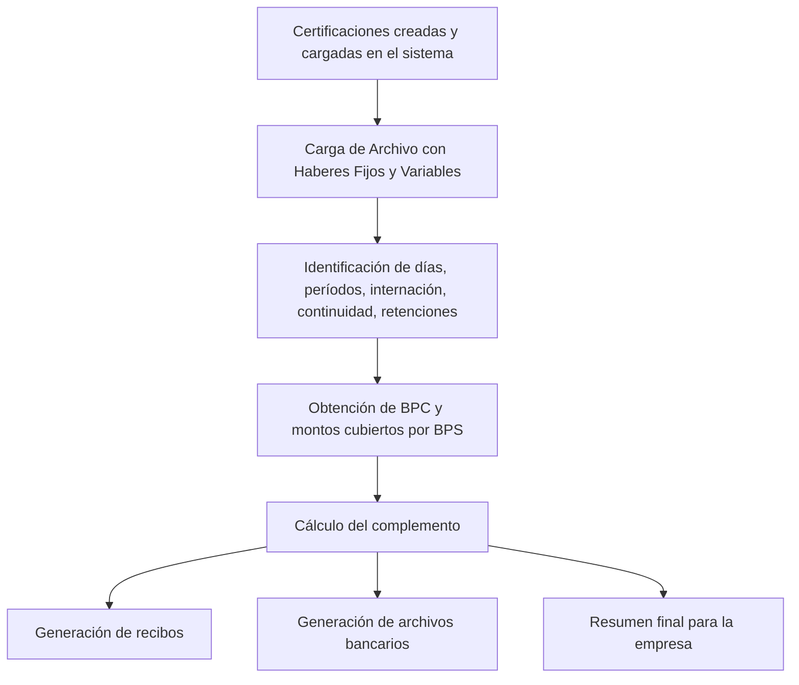

# Sistema de Liquidación de Subsidios por Certificaciones Médicas

Aplicación desarrollada en **PHP + MySQL** que automatiza la liquidación del subsidio económico correspondiente a las certificaciones médicas de empleados.  
El sistema centraliza las certificaciones, evalúa múltiples condiciones laborales y genera los montos complementarios que deben pagarse para evitar pérdidas económicas durante los días certificados.

---

## 🚀 Funcionalidades principales

- Procesamiento automático de certificaciones médicas del mes.
- Carga de Archivo brindado por la Empresa con los haberes fijos y variables de los ultimos 6 meses.
- Procesamiento y calculo de haberes por funcionario certificado.
- Evaluación de:
  - Cantidad de días certificados.
  - Continuación de certificaciones previas.
  - Internación o tratamientos especiales.
  - Retenciones de haberes (hijos, judiciales, etc.).
- Cálculo automático según:
  - Valor vigente de la BPC.
  - Montos cubiertos por BPS.
- Generación de:
  - Recibos por empleado.
  - Archivos bancarios para depósito.
  - Resumen final por empresa.

---

## 🖥️ Capturas del sistema


### 📍 Formulario de creació de certificación médica


### 📍 Certificacion generada y enviada al paciente


### 📍 Panel de liquidacion


### 📍 Recibo generado para el empleado


### 📍 Listado de subsidios obtenidos


---

## 🔧 Flujo general del proceso de liquidación



🧩 Cálculo del complemento según días cubiertos por BPS y la empresa

Esta sección del sistema calcula cuánto corresponde pagar por cada certificación, considerando los días cubiertos por BPS, los que cubre la empresa y los días no pagos según la normativa.

La empresa comienza a pagar a partir del tercer día certificado, por lo que los primeros dos días del período se restan automáticamente.
Esta información ya está parametrizada y proviene de base de datos (campo dias_menos).

📌 ¿Qué calcula este módulo?

Valor diario de salario según BPS.

Valor diario de salario según empresa.

Días abonados por BPS.

Días abonados por la empresa.

Días no cubiertos (los primeros dos días).

Diferencia que debe pagar la empresa luego de descontar lo que cubre BPS.

Proporcional de aguinaldo.

📌  Cálculo del complemento SEFMU y monto cubierto por BPS

```php
$por_dia_bps = round(($sueldo_base['sueldo_bps'] / 30), 2);
$liquidacion_bps = $por_dia_bps * $certPer['dias_bps'];

$liquidacion_sefmu = 0;

$por_dia = ($sueldo_base['sueldo_sefmu'] / 30);
$liquidacion_sefmu = $por_dia * ($certPer['periodo_cant_dias'] - $certPer['dias_menos']);

$nominal = $liquidacion_sefmu;
$liquido_a_pagar_sefmu = $liquidacion_sefmu - $liquidacion_bps;

// Calcular el aguinaldo
$liquido_sefmu_sin_a = $liquido_a_pagar_sefmu;
$aguinaldo = $liquido_sefmu_sin_a / 12;

$liquido_a_pagar_sefmu = $liquido_sefmu_sin_a + $aguinaldo;
```

📌 Resumen del cálculo

✔ Se identifica cuántos días paga BPS y cuántos paga la empresa.

✔ Se descartan automáticamente los días no cubiertos (primeros 2).

✔ Se calcula el complemento económico.

✔ Se agrega concepto de aguinaldo proporcional.

✔ Resultado final listo para recibo y archivo bancario.


### 🧩 Detección de certificaciones continuadas

En este paso, el sistema verifica si la certificación actual **continúa inmediatamente** de la certificación anterior del mismo empleado.  
Esto es importante porque afecta el cálculo total de días certificados y también determina la cantidad de días **no cubiertos** por la empresa (que comienza a pagar recién a partir del día 3, valor obtenido desde una tabla configurada).

```php
$fin_licencia_anterior = $cert_de_funcionario[$i-1]['fin_licencia'];
$incio_licencia_actual = $certificacion['inicio_licencia'];

// El inicio esperado es el día siguiente al fin de la licencia anterior
$inicio_que_debe_ser = date("Y-m-d", strtotime($fin_licencia_anterior . "+ 1 days"));

if ($incio_licencia_actual == $inicio_que_debe_ser) {
    /**
     * Si el fin de la licencia anterior es exactamente
     * el día previo al inicio de la licencia actual,
     * entonces la certificación se considera continuada.
     */
    $continua_licencia = 1;
} else {
    /**
     * Si no, se trata de una certificación independiente.
     */
    $continua_licencia = 0;
}
```

#### ✔ ¿Qué resuelve este bloque?
- Detecta si la certificación **es continuación** de otra previa.  
- Permite unir correctamente los días para el cálculo del subsidio.  
- Determina cuántos días deben descontarse según la regla interna:  
  **la empresa comienza a cubrir a partir del día 3**,  
  obtenido desde la tabla de parámetros (`dias_menos`).  
- Asegura que no se liquiden días de más o de menos en casos de certificaciones encadenadas.

---
### 🧮 Distribución de días cubiertos por BPS entre períodos del mes

En este sistema, las certificaciones médicas pueden abarcar dos períodos distintos dentro del mes (por ejemplo, fin de mes → comienzo del mes siguiente).  
Por eso es necesario determinar cuántos días cubre BPS en cada uno de esos períodos:

- **Primera inserción:** días del mes inicial  
- **Segunda inserción:** días del mes final  

El algoritmo compara:

- `$cant_dias` → días totales certificados  
- `$dias_bps` → días cubiertos por BPS  
- `$can_numero` → días del primer mes  
- `$can_numero_mes_final` → días del segundo mes  

Según la diferencia entre los días totales y los días cubiertos por BPS, se aplican reglas para repartir los días correctamente.

```php
if ($cant_dias == $dias_bps) {
    // Si BPS cubre todos los días, los días se distribuyen igual en ambos períodos
    $dias_bps_primera_insersion = $can_numero;
    $dias_bps_segunda_insersion = $can_numero_mes_final;

} else {

    // Diferencia de 3 días entre total y días BPS
    if ($cant_dias - $dias_bps == 3) {
        if ($can_numero > 3) {
            $dias_bps_primera_insersion = $can_numero - 3;
            $dias_bps_segunda_insersion = $can_numero_mes_final;

        } else if ($can_numero == 3) {
            $dias_bps_primera_insersion = 0;
            $dias_bps_segunda_insersion = $can_numero_mes_final;

        } else if ($can_numero == 2) {
            $dias_bps_primera_insersion = 0;
            $dias_bps_segunda_insersion = $can_numero_mes_final - 1;

        } else if ($can_numero == 1) {
            $dias_bps_primera_insersion = 0;
            $dias_bps_segunda_insersion = $can_numero_mes_final - 2;
        }

    // Diferencia de 2 días
    } else if ($cant_dias - $dias_bps == 2) {
        if ($can_numero > 2) {
            $dias_bps_primera_insersion = $can_numero - 2;
            $dias_bps_segunda_insersion = $can_numero_mes_final;

        } else if ($can_numero == 2) {
            $dias_bps_primera_insersion = 0;
            $dias_bps_segunda_insersion = $can_numero_mes_final;

        } else if ($can_numero == 1) {
            $dias_bps_primera_insersion = 0;
            $dias_bps_segunda_insersion = $can_numero_mes_final - 1;
        }

    // Diferencia de 1 día
    } else if ($cant_dias - $dias_bps == 1) {
        if ($can_numero > 1) {
            $dias_bps_primera_insersion = $can_numero - 1;
            $dias_bps_segunda_insersion = $can_numero_mes_final;

        } else if ($can_numero == 1) {
            $dias_bps_primera_insersion = 0;
            $dias_bps_segunda_insersion = $can_numero_mes_final;
        }
    }
}
```

#### ✔ ¿Qué resuelve este bloque?

- Determina cómo **distribuir correctamente** los días subsidiados por BPS cuando una certificación **cruza de un mes a otro**.  
- Se adapta a los casos donde la diferencia entre días totales y días BPS es de **1, 2 o 3 días**, según normativa.  
- Calcula correctamente **cuántos días cubre BPS en cada período**, evitando inconsistencias en las liquidaciones.  
- Asegura que la parte que la empresa debe cubrir (SEFMU) se calcule sobre la base correcta.

---
✔ Generación de recibos y detalles finales

Este bloque corresponde a la etapa final del proceso, donde el sistema:

Crea el recibo PDF para cada funcionario.

Inserta la información procesada (días cubiertos, días no cubiertos, subsidios, totales).

Genera el detalle final para ser enviado al usuario o archivado dentro del sistema.
```php
📌 Fragmento destacado — Inicialización del PDF y estructura principal
$pdf = new FPDF();
$pdf->AddPage();
$pdf->SetFont('Arial', 'B', 12);

$pdf->Cell(0, 10, "Recibo Subsidio por Enfermedad", 0, 1, 'C');
$pdf->Ln(5);

$pdf->SetFont('Arial', '', 10);
$pdf->Cell(0, 8, "Funcionario: " . $usuario_nombre, 0, 1);
$pdf->Cell(0, 8, "Cedula: " . $cedula, 0, 1);
$pdf->Cell(0, 8, "Periodo: " . $periodo, 0, 1);
$pdf->Ln(4);

📌 Fragmento destacado — Tabla de días cubiertos y no cubiertos
$pdf->SetFont('Arial', 'B', 10);
$pdf->Cell(60, 8, "Concepto", 1);
$pdf->Cell(40, 8, "Cantidad de Dias", 1);
$pdf->Cell(40, 8, "Monto", 1);
$pdf->Ln();

$pdf->SetFont('Arial', '', 10);
$pdf->Cell(60, 8, "Dias cubiertos (empresa)", 1);
$pdf->Cell(40, 8, $dias_empresa, 1);
$pdf->Cell(40, 8, "$" . number_format($monto_empresa, 2), 1);
$pdf->Ln();

$pdf->Cell(60, 8, "Dias subsidiados (BPS)", 1);
$pdf->Cell(40, 8, $dias_bps, 1);
$pdf->Cell(40, 8, "$" . number_format($monto_bps, 2), 1);
$pdf->Ln();

📌 Fragmento destacado — Montos finales
$pdf->SetFont('Arial', 'B', 10);
$pdf->Ln(5);
$pdf->Cell(100, 8, "Total a cobrar:", 1);
$pdf->Cell(40, 8, "$" . number_format($total, 2), 1);

📌 Fragmento destacado — Salida del archivo
$nombre_pdf = "recibo_" . $cedula . "_" . $periodo . ".pdf";
$pdf->Output('F', "recibos/" . $nombre_pdf);
```
📝 Explicación técnica resumida

En esta etapa:

Se genera un nuevo PDF empleando FPDF.

Se insertan datos personales del funcionario y del período.

Se arma una tabla clara que muestra:

Días que paga la empresa

Días subsidiados por BPS

Montos correspondientes

Se calcula el total final.

El archivo se exporta a la carpeta configurada en el sistema.
