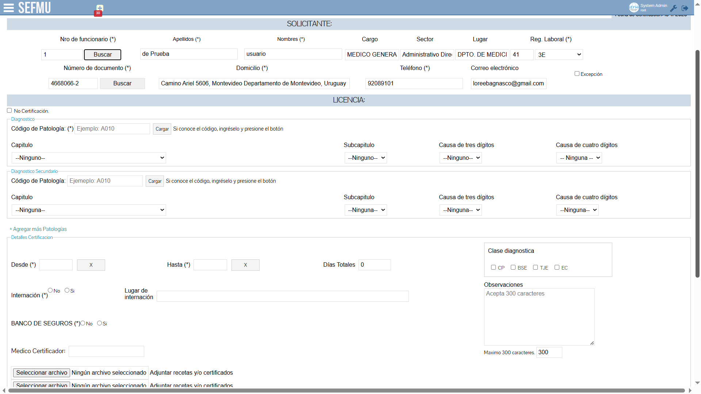
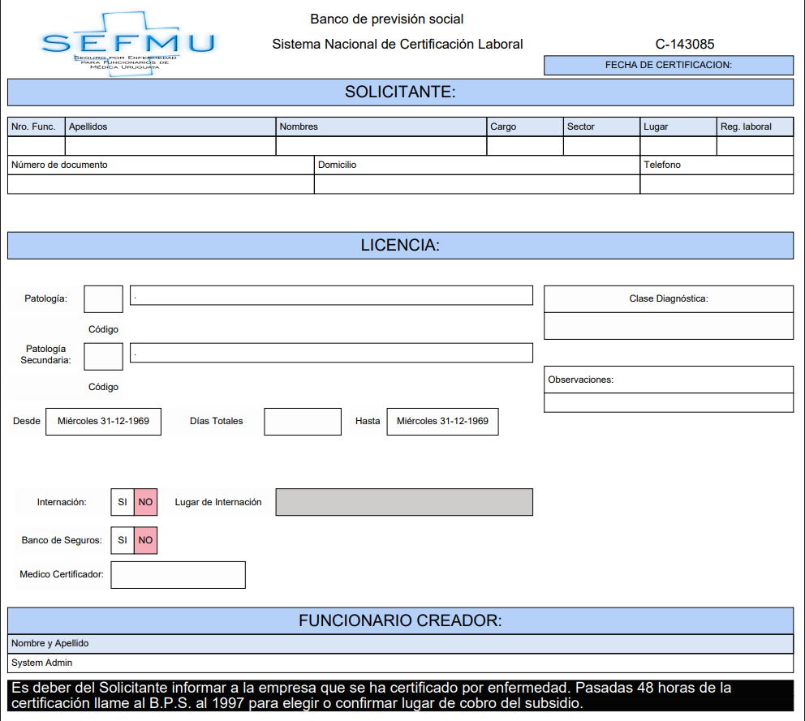
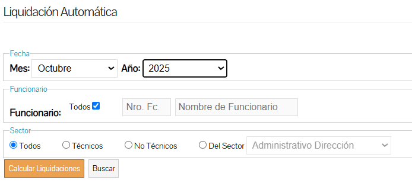
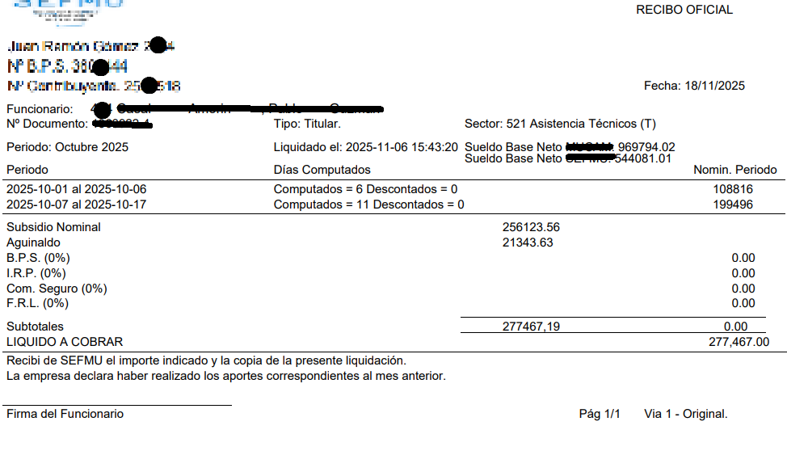
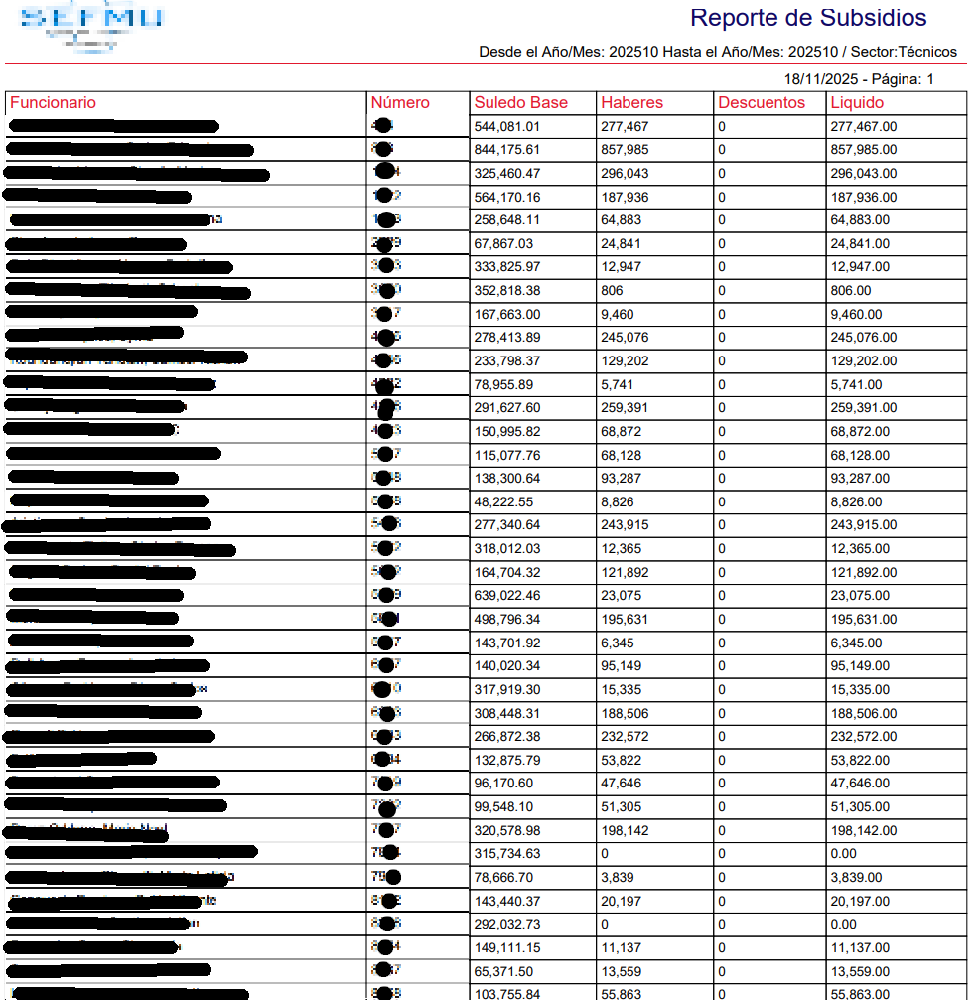

# Sistema de Liquidación de Subsidios por Certificaciones Médicas

Aplicación desarrollada en **PHP + MySQL** que automatiza la liquidación del subsidio económico correspondiente a las certificaciones médicas de empleados.  
El sistema centraliza las certificaciones, evalúa múltiples condiciones laborales y genera los montos complementarios que deben pagarse para evitar pérdidas económicas durante los días certificados.

---

## 🚀 Funcionalidades principales

- Procesamiento automático de certificaciones médicas del mes.
- Carga de Archivo brindado por la Empresa con los haberes fijos y variables de los ultimos 6 meses.
- Procesamiento y calculo de haberes por funcionario certificado.
- Evaluación de:
  - Cantidad de días certificados.
  - Continuación de certificaciones previas.
  - Internación o tratamientos especiales.
  - Retenciones de haberes (hijos, judiciales, etc.).
- Cálculo automático según:
  - Valor vigente de la BPC.
  - Montos cubiertos por BPS.
- Generación de:
  - Recibos por empleado.
  - Archivos bancarios para depósito.
  - Resumen final por empresa.

---

## 🖥️ Capturas del sistema


### 📍 Formulario de creació de certificación médica


### 📍 Certificacion generada y enviada al paciente


### 📍 Panel de liquidacion


### 📍 Recibo generado para el empleado


### 📍 Listado de subsidios obtenidos


---

## 🔧 Flujo general del proceso de liquidación

```mermaid
flowchart TD
A[Certificaciones creadas y cargadas en el sistema] --> B[Carga de Archivo con Haberes Fijos y Variables]
B --> C[Identificación de días, períodos, internación, continuidad, retenciones]
C --> D[Obtención de BPC y montos cubiertos por BPS]
D --> E[Cálculo del complemento]
E --> F[Generación de recibos]
E --> G[Generación de archivos bancarios]
E --> H[Resumen final para la empresa]
